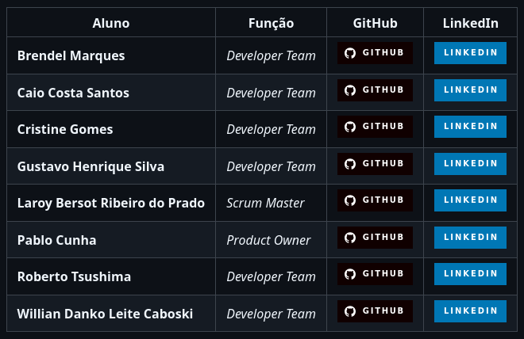

# Sobre mim

Me chamo Willian Danko, tenho 22 anos e sou graduando em Banco de Dados pela FATEC São José dos Campos.

Profissionalmente atuo como programador PLC na Axis Solutions.

 

# Projeto: Avaliação Democratizada

## Resumo do projeto

Este projeto foi desenvolvido tendo como cliente a própria FATEC São José dos Campos. O objetivo era criar uma aplicação que permitisse que os membros da instituição hipotética, a **PBLTeX**, avaliassem reciprocamente o desempenho de seus colegas em um processo de avaliação 360º.

Para muitos membros da equipe, esse foi o primeiro contato com a metodologia ágil. A fim de auxiliar os alunos nesse processo, a FATEC disponibilizou um professor para atuar como cliente e outros dois como orientadores Scrum, garantindo uma experiência o mais próxima possível de uma aplicação prática da metodologia Scrum.

## Tecnologias adotadas
A aplicação foi desenvolvida em Python, sem interface gráfica e sem banco de dados; todos os dados eram armazenados e manipulados em memória durante a execução.

## Projeto em funcionamento
O sistema era composto por três categorias de usuários: administradores, instrutores e alunos. Além disso, o sistema era dividido em turmas, formadas por alunos e instrutores. Para cada turma, um instrutor poderia atuar como Fake Client ou como Group Leader. Dentro de uma mesma turma, os alunos eram divididos em times, formados por um Líder Técnico, um Product Owner e demais membros.

Na hora da avaliação, um membro do time avaliava os outros membros, respondendo a cinco perguntas, cada uma com cinco opções de resposta. As respostas eram armazenadas em um arquivo de texto, permitindo a geração de relatórios com base nas avaliações realizadas. Um instrutor podia visualizar as avaliações de um aluno e gerar um relatório com as médias das avaliações. 
Além disso, um instrutor do tipo Fake Client avaliava os alunos que atuavam como Product Owner (PO), e um instrutor do tipo Group Leader avaliava os alunos que atuavam como Líder Técnico (LT).

## Uma visita ao projeto
Abaixo podemos vazer uma breve visita ao [repositório do projeto](https://github.com/DankoCaboski/API-BD1)

## Contribuições pessoais

Atuei como desenvolvedor, focado em implementar novas funcionalidades e otimizar o código-fonte do projeto.

Arrays e tuplas

Fui encarregado de criar os dados mock que seriam utilizados para popular a ferramenta e, durante essa atividade, tive meu primeiro contato com arrays e pude aprender a armazenar dados em listas e tuplas na memória em Python.

Validações condicionais

Também tive a oportunidade de aprender a implementar validações condicionais, a fim de atender às regras de negócio da aplicação, criando funcionalidades como a melhoria dos laços de chamada dos candidatos e a adição de limitações condicionais nas perguntas.

Ordenações

Durante o desenvolvimento de tarefas relacionadas à chamada de alunos para a avaliação, pude aprender a utilizar funcionalidades built-in do Python para tratar strings em memória.

