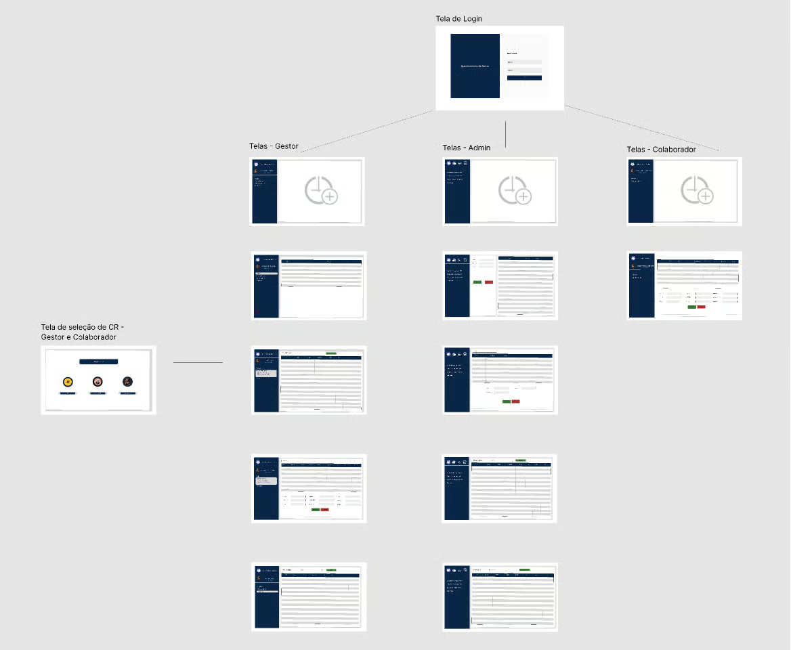

# Sobre mim

Me chamo Willian Danko, tenho 22 anos e sou graduando em Banco de Dados pela FATEC São José dos Campos.

Profissionalmente atuo como programador PLC na Axis Solutions.

 

# Projeto: Gestão de horas laborais

## Resumo do projeto

A 2RPnet é uma empresa brasileira de tecnologia com mais de 20 anos de experiência em meios de pagamento, soluções antifraude e análise de dados, destacando-se por soluções inovadoras e serviços de alta qualidade em TI.

Em detrimento de suas demandas internas por uma melhor gestão dos colaboradores alocados em diferentes projetos e necessitando de uma melhor gestão dos mesmos, a empresa nos contatou, interessada em desenvolver uma solução que possibilitasse centralizar o lançamento de horas trabalhadas dos membros da empresa.

Os usuários do sistema têm a possibilidade de centralizar o lançamento de suas horas trabalhadas e fazer a gestão de suas cargas de trabalho. Os gestores de cada equipe podem fazer a análise baseada nos membros de suas equipes, como a construção de relatórios, além de também poder gerenciar o acesso de seus liderados. Já os administradores representavam o cargo de usuário master no sistema, podendo fazer a demissão dos funcionários e o controle dos gestores.

## Tecnologias adotadas

O projeto foi inteiramente construído em Java, fazendo uso do framework **JavaFX** para a construção da interface gráfica.

A implementação do JavaFX foi uma demanda técnica solicitada pela FATEC, com o objetivo de garantir o contato de todos os alunos com essa linguagem de programação, que é uma das primeiras apresentadas no curso.

## Projeto em funcionamento
A aplicação possuía três fluxos de uso diferentes, sendo todos disparados após o login no sistema, de acordo com o perfil do usuário em questão.

Quando o usuário logado for um colaborador, sua tela de início contém seu espelho de horas trabalhadas no mês e um botão que dispara um modal para a entrada de novos registros.

O login como gestor nos traz para uma tela contendo os registros mais recentes dos membros de sua equipe e, a partir desse ponto, podemos usar os filtros para realizar consultas aos dados com base em datas, colaboradores ou projetos específicos.

O último nível de acesso, e o de maior importância, é o de administrador. Nesse acesso, podemos fazer o cadastro e a deleção de membros da empresa e promover colaboradores ao cargo de gestor.

## Uma visita ao projeto
Mais informações podem ser encontradas no seguinte [repositorio](https://github.com/codecatss/API-BD2).

## Contribuições Pessoais
Durante o desenvolvimento deste projeto, fui responsável pela elaboração dos arquivos que constituíam a estrutura básica das interfaces visuais, assegurando que cada componente estivesse otimizado para uma navegação intuitiva e eficiente. Além disso, trabalhei na implementação dos handlers, permitindo uma resposta ágil e funcionalidade precisa para interações do usuário, o que contribuiu para a estabilidade e a experiência do projeto como um todo.

Estrutura visual e navegação

Fui responsável por criar e organizar os arquivos que compunham a base das telas do sistema, garantindo que os elementos visuais estivessem bem distribuídos e que a navegação fosse intuitiva, além de assegurar uma uniformidade visual. Essa contribuição foi essencial para a usabilidade da aplicação, pois permitiu uma experiência de uso mais clara, direta e eficiente.

Handlers e interações do usuário

Também participei da implementação dos handlers, que permitiram controlar as ações do sistema em resposta às interações do usuário. Com isso, foi possível tornar o fluxo da aplicação mais funcional, reduzir problemas de comportamento e melhorar a estabilidade das telas e dos processos internos do software.

